<div align="center">


# Tracklane

**A keyboard-first issue tracker built on a hand-written, Linear-style local-first sync engine.**

Every client keeps a full replica of the workspace in IndexedDB, edits optimistically, and reconciles through a server-ordered transaction log over WebSockets. It keeps working offline and stays consistent across tabs, devices and teammates.

[](LICENSE)


[Why](#why-this-exists) · [Features](#feature-highlights) · [Screenshots](#screenshots) · [Architecture](#architecture) · [Decisions](#engineering-decisions-and-trade-offs) · [Quickstart](#quickstart) · [Testing](#testing) · [API](#api-overview)

<br />

<picture>
  <source media="(prefers-color-scheme: dark)" srcset="docs/screenshots/hero-list-dark.png" />
  <source media="(prefers-color-scheme: light)" srcset="docs/screenshots/hero-list-light.png" />
  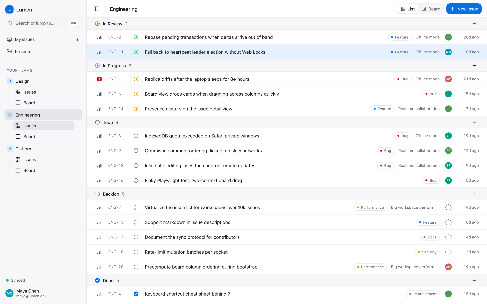
</picture>

</div>

---

## Why this exists

Most web apps treat the server as the only source of truth. Each click waits on a round trip, and the app stops working when the network does. Linear showed a different model: ship the workspace to the client, read from memory, write locally, and let a sync engine handle the network in the background.

Tracklane is a from-scratch take on that model, with no sync framework underneath. It exists to work through the hard parts in real code:

- **Ordering.** How do many writers agree on one history? A per-workspace counter, incremented inside a MongoDB transaction, gives every accepted change a gap-free `syncId`.
- **Optimism without lies.** How does a client show its own edits instantly and still end up exactly where the server is? Pending transactions are replayed on top of confirmed state using the *same* mutation engine the server runs.
- **Disconnection.** What happens after a laptop sleeps for 8 hours, or while three tabs are open? The client catches up with deltas or re-bootstraps, and one elected tab owns the socket for all the others.
- **Proof.** Property tests throw random interleavings, dropped links and log compaction at four replicas and check that they all converge.

## Feature highlights

| | |
|---|---|
| **Server-ordered transaction log** | Each accepted mutation increments the workspace `lastSyncId` (atomic Mongo counter inside a transaction), writes the entity, and appends a delta to `sync_actions` in the same commit. A change-stream publisher fans committed deltas out to per-team Socket.IO rooms. |
| **`@tracklane/sync-core`** | A framework-agnostic engine with an `ObjectPool` (confirmed state plus an optimistic overlay), a `TransactionQueue` outbox, a `Rebaser`, an `IdbStore` (built on `idb`), and a `SyncClient` that talks to the network only through a `SyncTransport` interface. |
| **Offline-first** | Mutations persist to an IndexedDB outbox before they reach the network. The outbox drains on reconnect, and pushes are idempotent per `clientTxId`, so a replayed entry is never applied twice. |
| **Conflict policy** | Last writer wins per field. Only the fields a patch touches are written, and each delta carries `changedFields`. Invalid workflow transitions, edits to archived issues, foreign references and permission violations are rejected with typed codes, and the client rolls back that one transaction. |
| **Multi-tab coordination** | One tab is elected leader (Web Locks, falling back to a heartbeat election over `BroadcastChannel`) and holds the only socket. Followers mirror its replica and route their writes through the shared outbox. |
| **Fine-grained reactivity** | React reads the pool through `useSyncExternalStore`. Lists select ids and each row subscribes to its own entity, and structurally equal entities keep their object identity, so an edit re-renders only the affected row. |
| **Permissions in the pipeline** | Team membership is checked inside the mutation engine. Catch-up deltas are filtered per team, sockets join only their team rooms, and membership is re-checked on a timer. When access changes, the server tells the client to re-bootstrap. |
| **Keyboard-first UX** | `cmdk` command palette (`⌘K`), `J`/`K` navigation, inline rename (`E`), status (`S`), assignee (`A`), priority (`0`–`4`), plus list and board views with `dnd-kit` drag and drop that refuses moves the workflow doesn't allow. |
| **Live presence** | Shows who is viewing an issue. Entries live in Redis sorted sets scored by expiry, refreshed by heartbeats and aggregated across tabs by the leader. |
| **Sync inspector** | `⌘.` opens a dev-tools panel that shows the connection state, tab role, local `lastSyncId`, pending transactions with their state (`queued`, `inflight`, `acked`), recent deltas, an offline toggle and a 0 to 2000 ms latency slider. |
| **Convergence proofs** | `fast-check` runs 150 random scenarios across four replicas with arbitrary message delivery order, link drops and log compaction, then asserts every replica equals the server's view. A Playwright suite covers the same behaviour across real browser contexts. |

## Screenshots

**Sync inspector, offline** (`⌘.`). Two renames were confirmed as deltas #1 and #2; the third is applied locally and waits in the outbox.

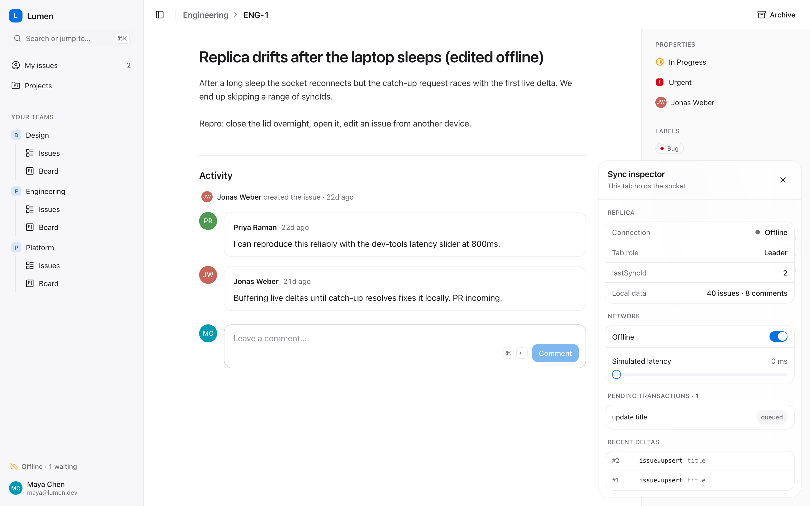

**Live presence.** Jonas has the same issue open in another browser.

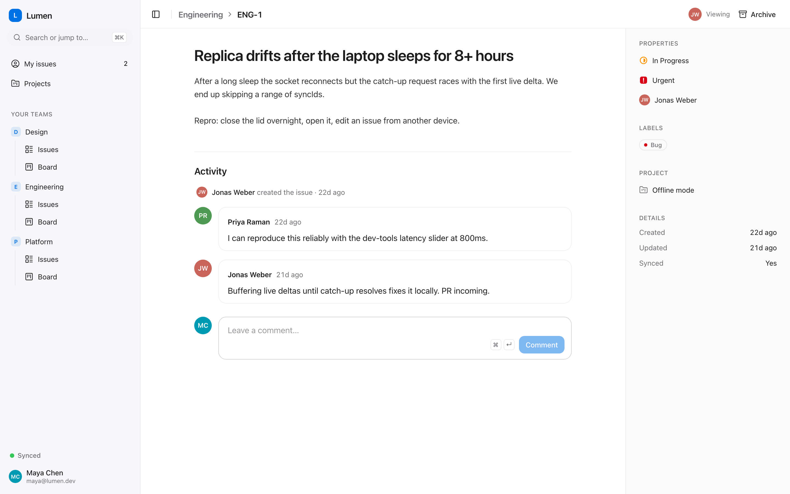

**Board.** Drag cards between columns; columns the workflow forbids are disabled while dragging.

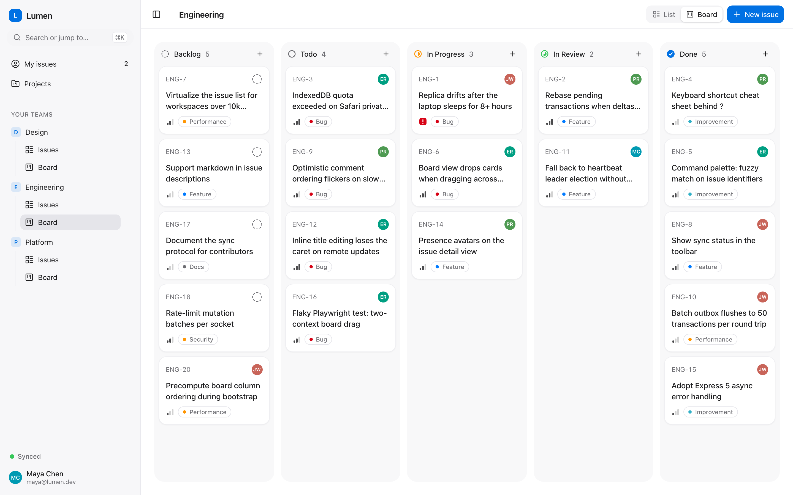

**Command palette** (`⌘K`). Search runs against the local replica, with no request per keystroke.

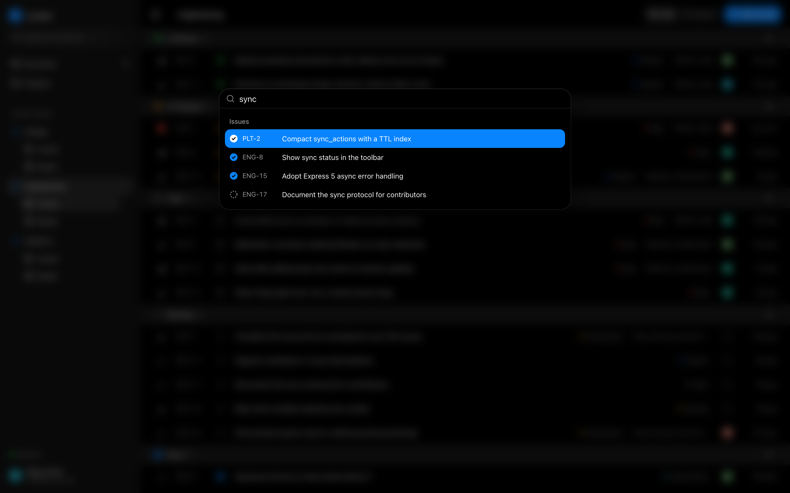

**Projects.** Progress is derived on the client from the replica.

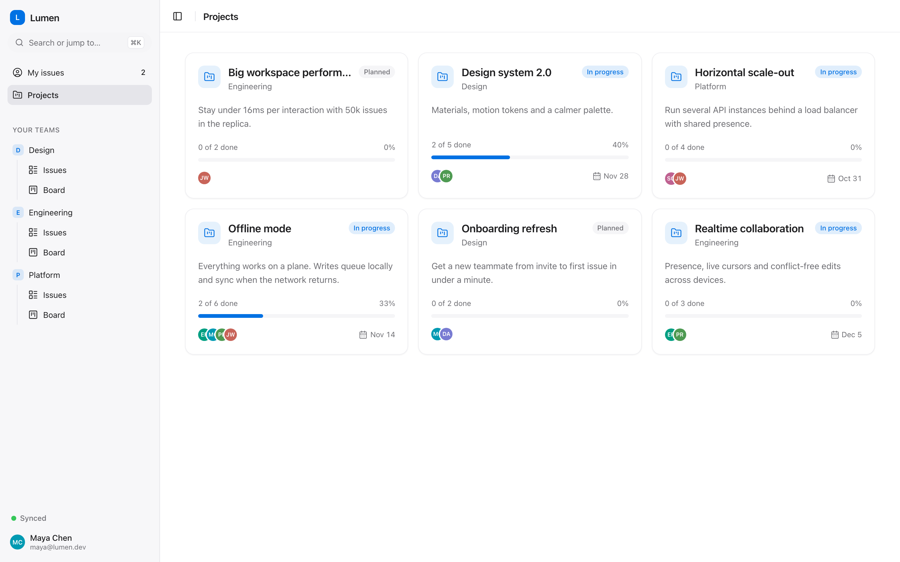

**Shortcuts** (`?`). Everything in the list and board can be driven from the keyboard.

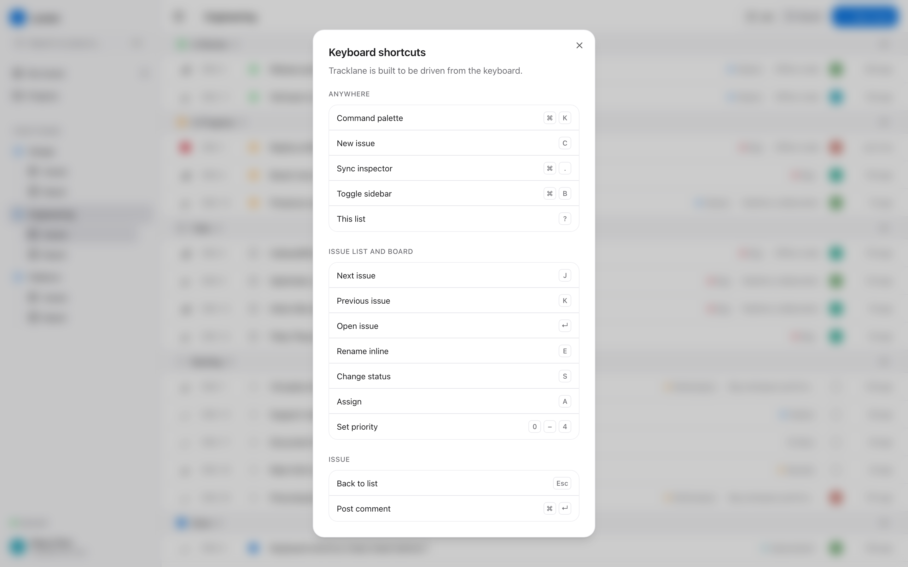

**On a phone.** The sidebar folds into a sheet, rows drop their secondary columns, and the board scrolls sideways a column at a time.

<p>
  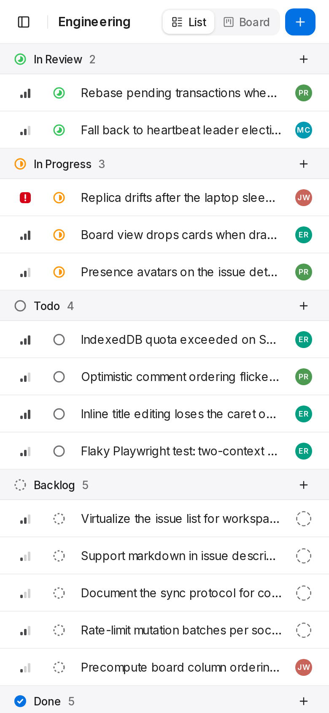
  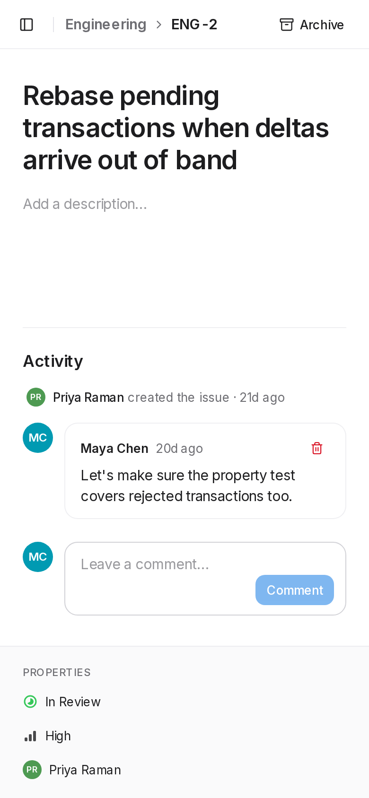
  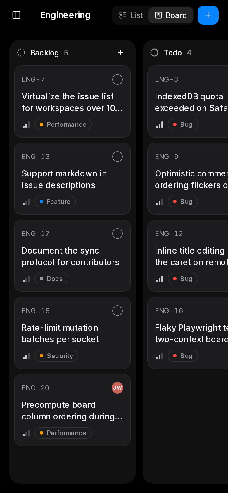
</p>

<details>
<summary><b>Sign-in screen (demo mode)</b></summary>
<br />
<picture>
  <source media="(prefers-color-scheme: dark)" srcset="docs/screenshots/login-dark.png" />
  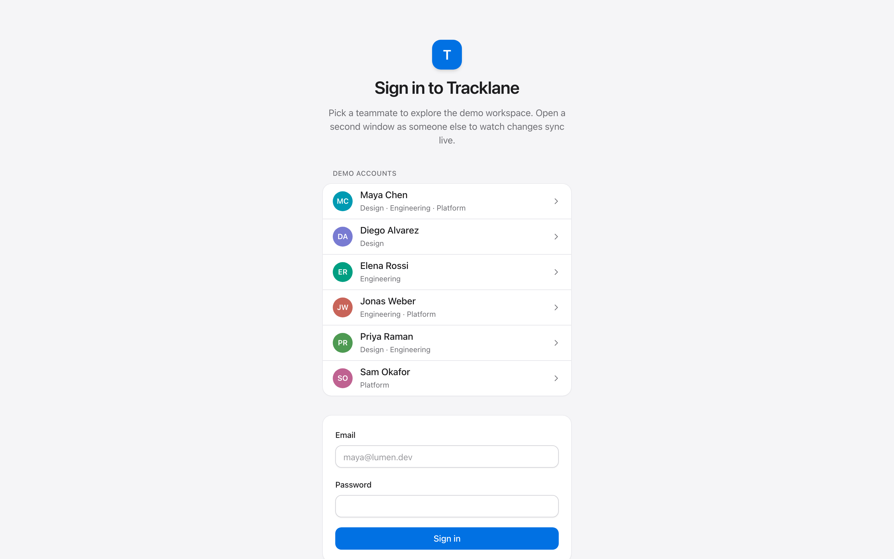
</picture>
</details>

## Architecture

### System overview

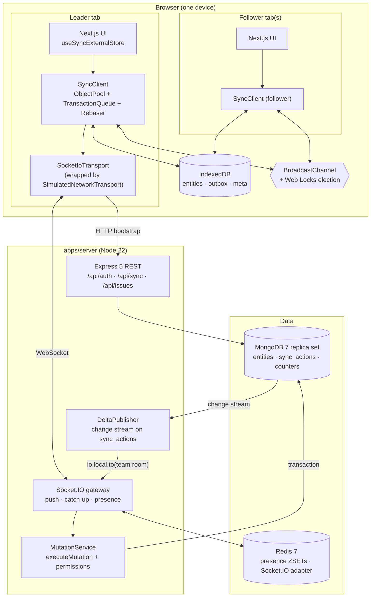
```mermaid
flowchart TB
  subgraph Browser["Browser (one device)"]
    direction LR
    subgraph Leader["Leader tab"]
      UI1["Next.js UI<br/>useSyncExternalStore"] --> SC1["SyncClient<br/>ObjectPool + TransactionQueue + Rebaser"]
      SC1 --> T1["SocketIoTransport<br/>(wrapped by SimulatedNetworkTransport)"]
    end
    subgraph Follower["Follower tab(s)"]
      UI2["Next.js UI"] --> SC2["SyncClient (follower)"]
    end
    IDB[("IndexedDB<br/>entities · outbox · meta")]
    BC{{"BroadcastChannel<br/>+ Web Locks election"}}
    SC1 <--> IDB
    SC2 <--> IDB
    SC1 <--> BC
    SC2 <--> BC
  end

  subgraph API["apps/server (Node 22)"]
    direction LR
    REST["Express 5 REST<br/>/api/auth · /api/sync · /api/issues"]
    GW["Socket.IO gateway<br/>push · catch-up · presence"]
    MS["MutationService<br/>executeMutation + permissions"]
    DP["DeltaPublisher<br/>change stream on sync_actions"]
    GW --> MS
  end

  subgraph Data["Data"]
    MDB[("MongoDB 7 replica set<br/>entities · sync_actions · counters")]
    RDS[("Redis 7<br/>presence ZSETs · Socket.IO adapter")]
  end

  T1 -- "HTTP bootstrap" --> REST
  T1 <-- "WebSocket" --> GW
  MS -- "transaction" --> MDB
  REST --> MDB
  MDB -- "change stream" --> DP
  DP -- "io.local.to(team room)" --> GW
  GW <--> RDS
```

### Packages

| Package | Role |
|---|---|
| `packages/domain` | Zod schemas (`Issue`, `Project`, `Team`, `Comment`, ...), the `Mutation` discriminated union, `SyncDelta`, the wire protocol, the issue workflow, and **`executeMutation`**, a pure function that both the server and the client's rebaser run. |
| `packages/sync-core` | The client engine. It has no React and no DOM assumptions beyond IndexedDB and BroadcastChannel, which sit behind interfaces. It ships `./testing` (in-memory server, scripted transport, fixtures) and `./socket-io` subpath exports. |
| `apps/server` | Express 5 + Socket.IO. Services (`MutationService`, `CatchUpService`, `BootstrapService`, `AccessService`, `RedisPresenceStore`) sit on top of repositories over Mongoose models. |
| `apps/web` | Next.js 15 App Router with shadcn/ui, `cmdk`, `dnd-kit` and `sonner`. All reads come from the local replica; the server is reached only through the sync engine. |

### Core flow: an optimistic edit

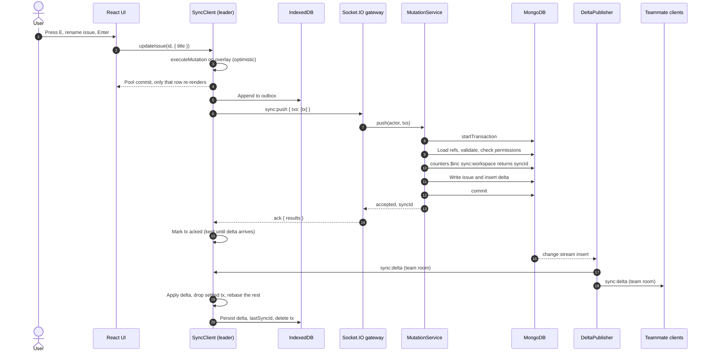
```mermaid
sequenceDiagram
  autonumber
  actor U as User
  participant UI as React UI
  participant SC as SyncClient (leader)
  participant IDB as IndexedDB
  participant GW as Socket.IO gateway
  participant MS as MutationService
  participant DB as MongoDB
  participant DP as DeltaPublisher
  participant P as Teammate clients

  U->>UI: Press E, rename issue, Enter
  UI->>SC: updateIssue(id, { title })
  SC->>SC: executeMutation on overlay (optimistic)
  SC-->>UI: Pool commit, only that row re-renders
  SC->>IDB: Append to outbox
  SC->>GW: sync:push { txs: [tx] }
  GW->>MS: push(actor, txs)
  MS->>DB: startTransaction
  MS->>DB: Load refs, validate, check permissions
  MS->>DB: counters.$inc sync:workspace returns syncId
  MS->>DB: Write issue and insert delta
  MS->>DB: commit
  MS-->>GW: accepted, syncId
  GW-->>SC: ack { results }
  SC->>SC: Mark tx acked (kept until delta arrives)
  DB-->>DP: change stream insert
  DP->>SC: sync:delta (team room)
  DP->>P: sync:delta (team room)
  SC->>SC: Apply delta, drop settled tx, rebase the rest
  SC->>IDB: Persist delta, lastSyncId, delete tx
```

If the server rejects the transaction (`invalid_transition`, `forbidden`, `archived`, ...), the client removes it from the queue and rebases. The optimistic change disappears, and the UI shows a toast for transactions that came from this tab.

### Reconnect: catch-up or re-bootstrap

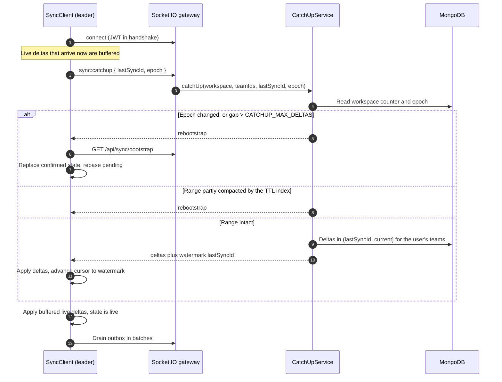
```mermaid
sequenceDiagram
  autonumber
  participant SC as SyncClient (leader)
  participant GW as Socket.IO gateway
  participant CU as CatchUpService
  participant DB as MongoDB

  SC->>GW: connect (JWT in handshake)
  Note over SC: Live deltas that arrive now are buffered
  SC->>GW: sync:catchup { lastSyncId, epoch }
  GW->>CU: catchUp(workspace, teamIds, lastSyncId, epoch)
  CU->>DB: Read workspace counter and epoch
  alt Epoch changed, or gap > CATCHUP_MAX_DELTAS
    CU-->>SC: rebootstrap
    SC->>GW: GET /api/sync/bootstrap
    SC->>SC: Replace confirmed state, rebase pending
  else Range partly compacted by the TTL index
    CU-->>SC: rebootstrap
  else Range intact
    CU->>DB: Deltas in (lastSyncId, current] for the user's teams
    CU-->>SC: deltas plus watermark lastSyncId
    SC->>SC: Apply deltas, advance cursor to watermark
  end
  SC->>SC: Apply buffered live deltas, state is live
  SC->>GW: Drain outbox in batches
```

The returned `lastSyncId` is the workspace counter, not the last delta the user could see. A client on a quiet team still advances its cursor even though most deltas are filtered out.

### Cross-tab coordination

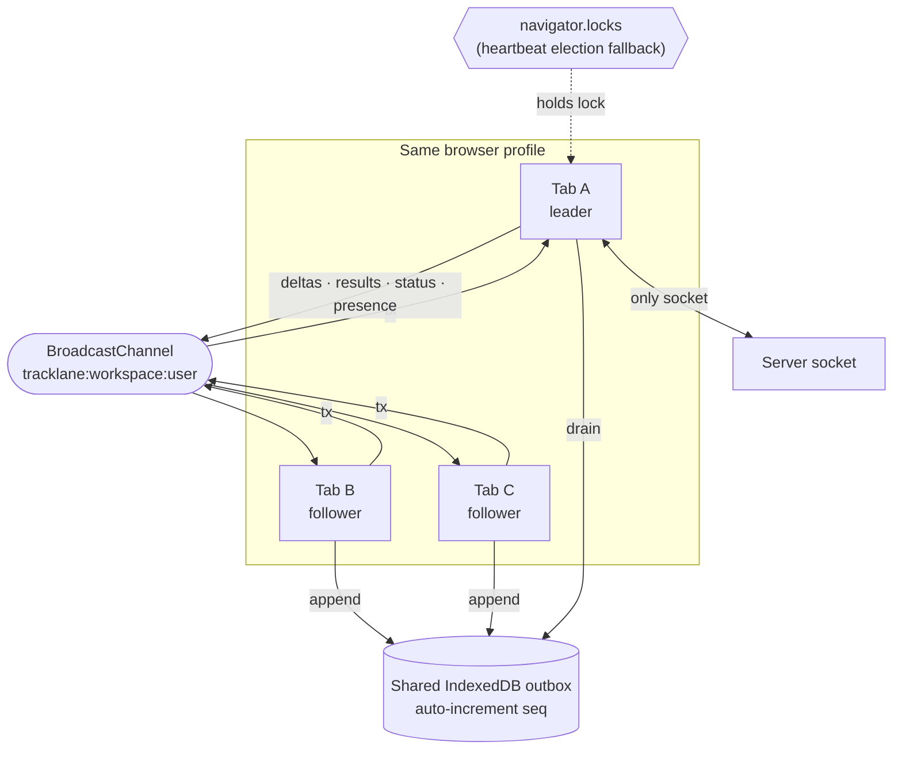
```mermaid
flowchart TB
  subgraph Tabs["Same browser profile"]
    A["Tab A<br/>leader"]
    B["Tab B<br/>follower"]
    C["Tab C<br/>follower"]
  end
  L{{"navigator.locks<br/>(heartbeat election fallback)"}}
  CH(["BroadcastChannel<br/>tracklane:workspace:user"])
  O[("Shared IndexedDB outbox<br/>auto-increment seq")]
  S["Server socket"]

  L -. "holds lock" .-> A
  B -- "tx" --> CH
  C -- "tx" --> CH
  CH -- "tx" --> A
  B -- "append" --> O
  C -- "append" --> O
  A -- "drain" --> O
  A <-- "only socket" --> S
  A -- "deltas · results · status · presence" --> CH
  CH --> B
  CH --> C
```

When the leader tab closes, the browser releases the Web Lock and another tab takes over. It reloads the replica and outbox from IndexedDB, since that is the source of truth, before it opens its own socket. In the heartbeat fallback, the lowest claiming tab id wins, and a split brain resolves with the higher id stepping down.

### User flow

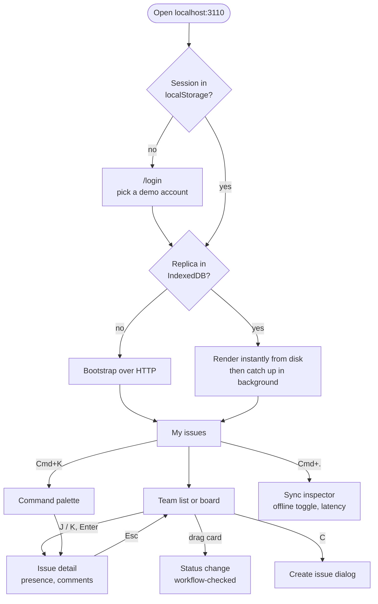
```mermaid
flowchart TD
  Start(["Open localhost:3110"]) --> HasSession{"Session in<br/>localStorage?"}
  HasSession -- "no" --> Login["/login<br/>pick a demo account"]
  Login --> Replica
  HasSession -- "yes" --> Replica{"Replica in<br/>IndexedDB?"}
  Replica -- "no" --> Boot["Bootstrap over HTTP"]
  Replica -- "yes" --> Instant["Render instantly from disk<br/>then catch up in background"]
  Boot --> MyIssues["My issues"]
  Instant --> MyIssues
  MyIssues --> Team["Team list or board"]
  Team -- "J / K, Enter" --> Issue["Issue detail<br/>presence, comments"]
  Team -- "drag card" --> Move["Status change<br/>workflow-checked"]
  Team -- "C" --> Create["Create issue dialog"]
  Issue -- "Esc" --> Team
  MyIssues -- "Cmd+K" --> Palette["Command palette"]
  Palette --> Issue
  MyIssues -- "Cmd+." --> Inspector["Sync inspector<br/>offline toggle, latency"]
```

### Issue workflow

The server enforces these transitions, and the client checks them too, both optimistically and on the board.

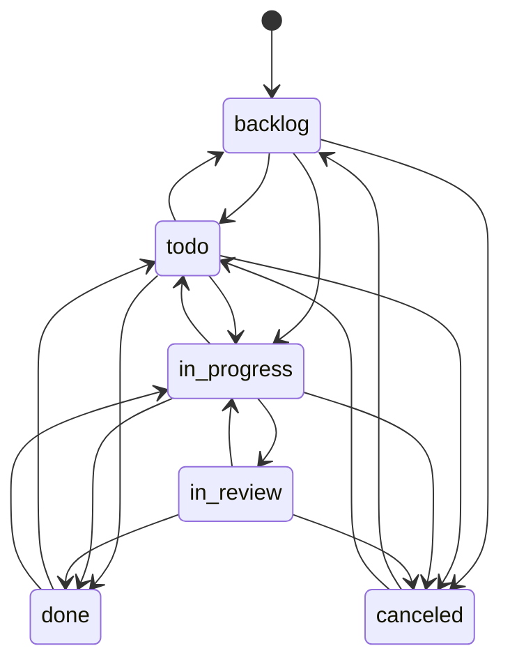
```mermaid
stateDiagram-v2
  [*] --> backlog
  backlog --> todo
  backlog --> in_progress
  backlog --> canceled
  todo --> backlog
  todo --> in_progress
  todo --> done
  todo --> canceled
  in_progress --> todo
  in_progress --> in_review
  in_progress --> done
  in_progress --> canceled
  in_review --> in_progress
  in_review --> done
  in_review --> canceled
  done --> todo
  done --> in_progress
  canceled --> backlog
  canceled --> todo
```

### Data model

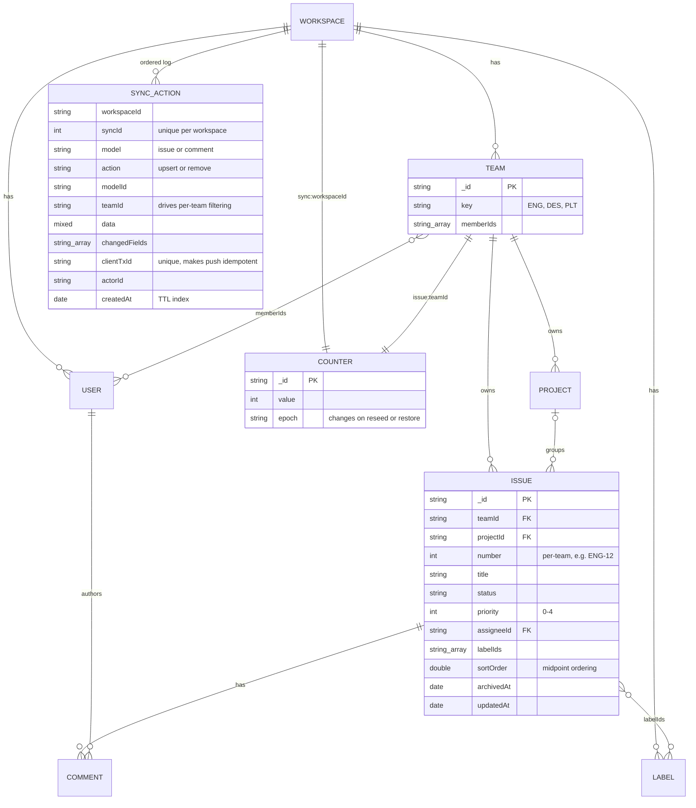
```mermaid
erDiagram
  WORKSPACE ||--o{ USER : has
  WORKSPACE ||--o{ TEAM : has
  WORKSPACE ||--o{ LABEL : has
  WORKSPACE ||--|| COUNTER : "sync:workspaceId"
  TEAM ||--o{ PROJECT : owns
  TEAM ||--o{ ISSUE : owns
  TEAM ||--|| COUNTER : "issue:teamId"
  TEAM }o--o{ USER : memberIds
  PROJECT |o--o{ ISSUE : groups
  ISSUE ||--o{ COMMENT : has
  USER ||--o{ COMMENT : authors
  ISSUE }o--o{ LABEL : labelIds
  WORKSPACE ||--o{ SYNC_ACTION : "ordered log"

  ISSUE {
    string _id PK
    string teamId FK
    string projectId FK
    int number "per-team, e.g. ENG-12"
    string title
    string status
    int priority "0-4"
    string assigneeId FK
    string_array labelIds
    double sortOrder "midpoint ordering"
    date archivedAt
    date updatedAt
  }
  SYNC_ACTION {
    string workspaceId
    int syncId "unique per workspace"
    string model "issue or comment"
    string action "upsert or remove"
    string modelId
    string teamId "drives per-team filtering"
    mixed data
    string_array changedFields
    string clientTxId "unique, makes push idempotent"
    string actorId
    date createdAt "TTL index"
  }
  COUNTER {
    string _id PK
    int value
    string epoch "changes on reseed or restore"
  }
  TEAM {
    string _id PK
    string key "ENG, DES, PLT"
    string_array memberIds
  }
```

## Engineering decisions and trade-offs

**One mutation engine, two call sites.** `executeMutation(reader, mutation, options)` in `packages/domain` is pure. The server runs it against entities loaded in a Mongo session; the client's `rebase()` runs it against an overlay of confirmed state. Optimistic state is therefore exactly what the server would compute if it processed the outbox right now, with no duplicated validation logic. *Trade-off:* the engine must stay deterministic and I/O-free, so things like issue numbers are passed in (`allocateIssueNumber`, which is `0` on the client and shown as pending until the delta lands).

**A counter document, not timestamps or ObjectIds, for ordering.** Incrementing `counters/sync:<workspaceId>` inside the write transaction gives gap-free, totally ordered `syncId`s per workspace. Concurrent writers conflict on the counter, and `withTransaction` retries them. *Trade-off:* writes to a workspace are effectively serialised on one document. That is fine for a team-sized workspace, but a multi-tenant SaaS at Linear's scale would shard the log.

**Fan-out from the change stream, not from the request handler.** The mutation service only commits. Every API instance tails `sync_actions` and emits with `io.local` to its own sockets. Change-stream order equals commit order, which the counter makes equal to `syncId` order, so a delta is never broadcast for a transaction that later aborts. Instances also don't double-broadcast through the Redis adapter. The publisher resumes from its last token after an error.

**Field-level last-writer-wins, with server-side rejection for invariants.** Patches carry only changed fields, so two people editing title and priority at the same time both win. Rules that can't be merged (workflow transitions, archived issues, team membership, assignees outside the team) are rejected per transaction rather than per batch. A malformed outbox entry is rejected by `clientTxId` so it can't block everything queued behind it.

**Epochs and compaction.** The log is TTL-compacted (`SYNC_LOG_RETENTION_DAYS`). Catch-up compares the retained count against the requested `syncId` span, and if anything is missing it orders a re-bootstrap instead of serving a silent gap. A reseed or restore writes a new `epoch`, so an old cursor can't be reused even when its number happens to be valid.

**Leader election with Web Locks first.** The browser releases a Web Lock when a tab dies, so there's no timeout to wait out. A heartbeat elector over `BroadcastChannel` covers environments without `navigator.locks`. *Trade-off:* followers depend on the leader for network I/O, and in exchange a workspace never holds N sockets for N tabs.

**Identity-preserving commits for React.** `ObjectPool.commit()` recomputes only staged keys and keeps the previous object when the new one is structurally equal. With `useSyncExternalStore` selectors over ids, a remote edit to one issue re-renders one row, not the list.

**Security posture.** Passwords are hashed with scrypt and compared in constant time, including against a dummy hash for unknown emails. JWTs are signed with `jose`, and the server refuses placeholder secrets in production. Logins are rate-limited per IP and per email. Socket events are throttled with token buckets, and sockets are disconnected when their token expires. The sign-in screen lists demo accounts only when `DEMO_MODE` is explicitly enabled.

## Tech stack

| Layer | Choice | Why |
|---|---|---|
| Language | TypeScript 6, `strict`, `noUncheckedIndexedAccess`, `exactOptionalPropertyTypes` | One type system from Mongo document to React prop |
| Shared contracts | Zod 4 | Runtime validation at every boundary; types inferred, never duplicated |
| Client engine | `idb`, `BroadcastChannel`, Web Locks | Durable replica and single-socket multi-tab coordination |
| Realtime | Socket.IO 4 + `@socket.io/redis-adapter` | Acks, rooms, reconnection; horizontal scale-out |
| API | Node 22, Express 5, Pino, Helmet | Async error handling, structured logs |
| Database | MongoDB 7 replica set, Mongoose 9 | Multi-document transactions, change streams, TTL indexes |
| Cache / presence | Redis 7, ioredis | Expiring presence sets, adapter pub/sub |
| Web | Next.js 15 App Router, React 19, shadcn/ui, Tailwind 4 | Apple-inspired, calm UI with system light/dark |
| Interaction | `cmdk`, `@dnd-kit`, `sonner`, `lucide-react` | Palette, drag and drop, toasts, icons |
| Testing | Vitest 5, fast-check 4, `fake-indexeddb`, `mongodb-memory-server`, Supertest, Playwright 1.63 | Unit, property, integration and multi-context e2e |
| Tooling | pnpm 9 workspaces, ESLint 9 (typescript-eslint), Docker Compose | |

## Project structure

```text
tracklane/
├── apps/
│   ├── server/                     Express 5 + Socket.IO API
│   │   ├── src/
│   │   │   ├── db/                 Mongoose models, TTL index management, mappers
│   │   │   ├── http/               app, middleware, routes (auth, sync, issues)
│   │   │   ├── realtime/           socket gateway, change-stream delta publisher
│   │   │   ├── repositories/       entity, sync-log, counter, workspace, user
│   │   │   ├── services/           mutation, catch-up, bootstrap, access, presence, auth, rate limiter
│   │   │   └── seed/               demo workspace "Lumen"
│   │   └── test/                   pipeline, realtime, HTTP and hardening suites
│   └── web/                        Next.js 15 client
│       ├── app/                    /login, /my-issues, /projects, /team/[key], /team/[key]/board, /issue/[id]
│       ├── components/
│       │   ├── issue/              list, row, board, detail, pickers, keyboard navigation
│       │   ├── shell/              sidebar, command palette, sync inspector, shortcuts
│       │   └── ui/                 shadcn/ui primitives
│       ├── lib/sync/               client factory, React provider, useSelector/useEntity hooks
│       └── e2e/                    Playwright multi-context specs
├── packages/
│   ├── domain/                     Zod schemas, Mutation union, deltas, protocol, workflow, executeMutation
│   └── sync-core/                  ObjectPool, TransactionQueue, Rebaser, SyncClient, IdbStore,
│       │                           leader election, TabCoordinator, PresenceCoordinator, transports
│       ├── src/testing/            InMemorySyncServer, ScriptedTransport, fixtures
│       └── test/                   unit, multi-tab and convergence property tests
├── scripts/
│   └── dev-db.sh                   mongod (rs0) + redis without Docker, data in .data/
├── docs/screenshots/
├── .nvmrc                          Node 22
└── docker-compose.yml
```

## Quickstart

### Prerequisites

Node.js 22 (`.nvmrc`), pnpm 9, and local `mongod`, `mongosh` and `redis-server` binaries. If you'd rather not install those, use Docker Compose below.

### Local (no Docker)

```bash
pnpm install
cp .env.example apps/server/.env          # set JWT_SECRET: openssl rand -base64 48
cp apps/web/.env.example apps/web/.env.local

pnpm db:up      # mongod as replica set rs0 on :27110, redis on :6410, data in .data/
pnpm seed       # demo workspace "Lumen": 6 people, 3 teams, 40 issues
pnpm build

# in two terminals
pnpm --filter @tracklane/server start      # API on http://localhost:8110
pnpm --filter @tracklane/web start         # web on http://localhost:3110
```

Or run `pnpm dev` for watch mode across all four packages.

Open **http://localhost:3110/login** and pick a demo account. Every account uses the password `tracklane`. For the best demo, sign in as **Maya** in one window and **Jonas** in a private window, open the same issue in both, and press `⌘.` to watch deltas stream in. Then toggle offline, make an edit, and toggle back.

To stop, kill the processes on `:8110` and `:3110`, then run `pnpm db:down`.

### Docker Compose

```bash
JWT_SECRET=$(openssl rand -base64 48) docker compose up --build
```

This starts Mongo 7 (it initiates `rs0` on first boot), Redis 7, a one-shot seed job, the API on `:8110` and the web app on `:3110`. Compose refuses to start without `JWT_SECRET`, and there is deliberately no default.

## Configuration

Server settings live in `apps/server/.env` and are validated with Zod at boot. The process exits with a readable error if any value is invalid.

| Variable | Default | Description |
|---|---|---|
| `NODE_ENV` | `development` | `development`, `test` or `production`. Production rejects placeholder secrets. |
| `PORT` | `8110` | API port |
| `MONGO_URL` | `mongodb://127.0.0.1:27110/tracklane?replicaSet=rs0` | Must point at a replica set, which transactions and change streams need |
| `REDIS_URL` | `redis://127.0.0.1:6410` | Presence store and Socket.IO adapter |
| `JWT_SECRET` | *(required)* | At least 32 characters |
| `JWT_TTL_SECONDS` | `86400` | Token lifetime; sockets are disconnected when it expires |
| `CORS_ORIGIN` | `http://localhost:3110` | Comma-separated allowed origins |
| `LOG_LEVEL` | `info` | Pino level |
| `SYNC_LOG_RETENTION_DAYS` | `14` | TTL for `sync_actions`; older clients re-bootstrap |
| `CATCHUP_MAX_DELTAS` | `5000` | Above this gap, catch-up asks for a re-bootstrap instead |
| `PRESENCE_TTL_SECONDS` | `30` | Presence entry lifetime without a heartbeat |
| `ACCESS_REFRESH_SECONDS` | `60` | How often live sockets re-check team membership |
| `LOGIN_RATE_LIMIT` | `10` | Attempts per IP and per email per window (the dev `.env` uses `100`) |
| `LOGIN_RATE_WINDOW_SECONDS` | `60` | Rate-limit window |
| `DEMO_MODE` | `false` | Lists the demo workspace's accounts on the sign-in screen |
| `DEMO_WORKSPACE_SLUG` | `lumen` | Workspace that demo mode exposes |
| `TRUST_PROXY_HOPS` | `0` | Reverse proxies in front of the API. Leave at `0` unless a proxy overwrites `X-Forwarded-For`; otherwise clients could pick the IP the login limit counts against |

Web settings go in `apps/web/.env.local`:

| Variable | Default | Description |
|---|---|---|
| `NEXT_PUBLIC_API_URL` | `http://localhost:8110` | API base URL for REST and Socket.IO. It is baked in at build time. |

## Testing

```bash
pnpm typecheck && pnpm lint && pnpm test
```

`pnpm test` needs no running database: server suites start an in-memory MongoDB replica set with `mongodb-memory-server`, and client suites use `fake-indexeddb`.

The first server test run downloads a `mongod` binary into the `mongodb-memory-server` cache. MongoDB publishes no build for some platforms (Debian on arm64, for one), and the download fails offline; in both cases point `MONGOMS_SYSTEM_BINARY` at an existing `mongod`, for example the one in the `mongo:7` image.

| Suite | Where | What it proves |
|---|---|---|
| Convergence properties | `packages/sync-core/test/convergence.property.test.ts` | Four replicas (one user on two devices plus two teammates), 150 random command sequences mixing mutations, out-of-order request/response/inbound delivery, link drops and log compaction. Afterwards every replica is `live`, has an empty outbox and equals the server's per-user view. A second property checks that optimistic state equals confirmed state plus the replayed queue. |
| Engine | `packages/domain/test` | Field-by-field patch merging, no-op detection, workflow transitions, team membership, reference validation, archived-issue rules, midpoint ordering |
| Sync core | `packages/sync-core/test` | Object pool identity, outbox ordering and reconcile, IndexedDB persistence and versioning, leader election, multi-tab write-through, backoff |
| Mutation pipeline | `apps/server/test/mutation-pipeline.test.ts` | Change, counter bump and delta in one transaction; gap-free `syncId`s and issue numbers under concurrent writers; idempotent replays scoped to the actor; no-ops and rejections never consume a `syncId`; per-team delta filtering; re-bootstrap on compaction or epoch change; TTL updates in place |
| Realtime | `apps/server/test/realtime.test.ts` | Socket auth, team-room fan-out, per-entry rejection of malformed transactions, presence, two full `SyncClient` replicas converging through the real server, offline catch-up, access revocation, token expiry, push flood rate limiting |
| HTTP and hardening | `apps/server/test/http.test.ts`, `hardening.test.ts` | Health, credential and body validation, cursor pagination, compression, login 429 with `Retry-After`, demo-mode gating, refusal of example secrets in production |
| Web units | `apps/web/lib/__tests__` | Hotkey routing rules, board drop logic and forbidden moves, status grouping, `useSelector` re-rendering only on changed selections |
| End to end | `apps/web/e2e/sync.spec.ts` | Two users see each other's edits and presence; offline edits queue and sync on reconnect; tabs elect one leader and followers write through it; the board refuses illegal moves |

Run the Playwright suite against running servers (after `pnpm db:up && pnpm seed`):

```bash
cd apps/web && E2E_EXTERNAL_SERVERS=1 npx playwright test
```

Without `E2E_EXTERNAL_SERVERS`, Playwright starts the built API and web app itself.

## API overview

### REST

| Method | Path | Auth | Description |
|---|---|---|---|
| `GET` | `/healthz` | – | `{ status, checks: { mongo, redis } }`; returns 503 when degraded |
| `POST` | `/api/auth/login` | – | `{ email, password }` → `{ token, user, workspace }`; rate-limited |
| `GET` | `/api/auth/me` | Bearer | Current user and accessible teams |
| `GET` | `/api/auth/demo-accounts` | – | Demo accounts when `DEMO_MODE=true`, otherwise an empty list |
| `GET` | `/api/sync/bootstrap` | Bearer | Full replica for the caller's teams plus `{ lastSyncId, epoch }` |
| `GET` | `/api/sync/deltas?after=&epoch=` | Bearer | HTTP version of socket catch-up, handy with `curl` |
| `GET` | `/api/issues?teamId=&limit=&cursor=` | Bearer | Keyset-paginated, read-only listing for integrations |

Captured against the Compose stack with the seeded Lumen workspace (IDs shortened, token redacted):

```bash
curl -s localhost:8110/healthz
```

```json
{"status":"ok","checks":{"mongo":"up","redis":"up"}}
```

```bash
curl -s localhost:8110/api/auth/login -H 'content-type: application/json' \
  -d '{"email":"maya@lumen.dev","password":"tracklane"}'
```

```json
{
  "token": "eyJhbG…ZgeY",
  "user": { "id": "31e544b2-…", "workspaceId": "70a9948c-…", "name": "Maya Chen", "email": "maya@lumen.dev", "role": "admin", "avatarHue": 211 },
  "workspace": { "id": "70a9948c-…", "name": "Lumen", "slug": "lumen" }
}
```

```bash
curl -s "localhost:8110/api/issues?limit=1" -H "authorization: Bearer $TOKEN"
```

```json
{
  "issues": [
    {
      "id": "d4a4f247-…", "teamId": "c395de16-…", "projectId": null, "number": 10,
      "title": "Redesign the issue inspector", "description": "", "status": "todo", "priority": 3,
      "assigneeId": "3dec16ca-…", "labelIds": ["3f615551-…"], "sortOrder": 10240,
      "createdAt": "2026-11-07T15:37:53.971Z", "updatedAt": "2026-11-08T08:37:53.971Z", "archivedAt": null
    }
  ],
  "nextCursor": "eyJ1cGRhdGVkQXQiOiIyMDI2LTExLTA4VDA4OjM3OjUzLjk3MVoiLCJpZCI6ImQ0YTRmMjQ3LTlkOWQtNDU2Mi04MThmLWY1ZGQzNzI5MGMxMSJ9"
}
```

A fresh seed's `GET /api/sync/bootstrap` for Maya returns 6 users, 3 teams, 6 projects, 7 labels, 40 issues and 8 comments at `lastSyncId: 0`.

### Socket.IO events

The client authenticates with `auth: { token }` in the handshake.

| Event | Direction | Payload |
|---|---|---|
| `sync:push` | client → server (ack) | `{ txs: Transaction[] }` (max 100) → `{ results: TxResult[] }` where each result is `accepted` with `syncId`, `noop`, or `rejected` with a code |
| `sync:catchup` | client → server (ack) | `{ lastSyncId, epoch }` → `{ kind: "deltas", deltas, lastSyncId }` or `{ kind: "rebootstrap" }` |
| `sync:delta` | server → client | `SyncDelta` for one of the client's teams |
| `sync:resync` | server → client | `{ reason: "access_changed" }`, after which the client re-bootstraps |
| `presence:view` | client → server | `{ issueIds }` open across all tabs of this browser |
| `presence:heartbeat` | client → server | Refreshes presence TTLs |
| `presence:update` | server → client | `{ issueId, viewerIds }` |

The `Mutation` union has six kinds: `issue.create`, `issue.update` (a partial, strict patch), `issue.archive`, `issue.unarchive`, `comment.create` and `comment.delete`.

## Roadmap

- [ ] Virtualized list rendering for workspaces with tens of thousands of issues
- [ ] Partial bootstrap: load closed and archived issues lazily
- [ ] Shard the sync log by team to lift the per-workspace write serialization
- [ ] Rich-text descriptions with a CRDT for concurrent edits within one field
- [ ] Undo/redo built on inverse mutations in the transaction queue
- [ ] Service worker so the app shell also loads offline

## License

[MIT](LICENSE)
